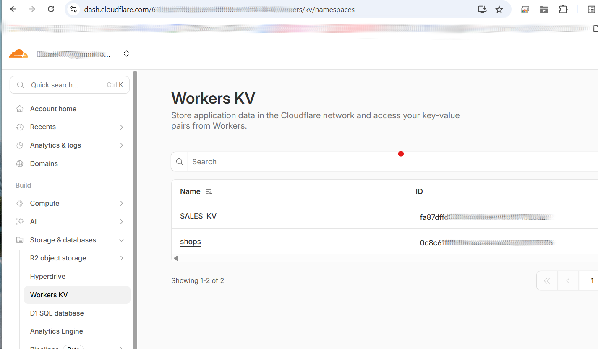
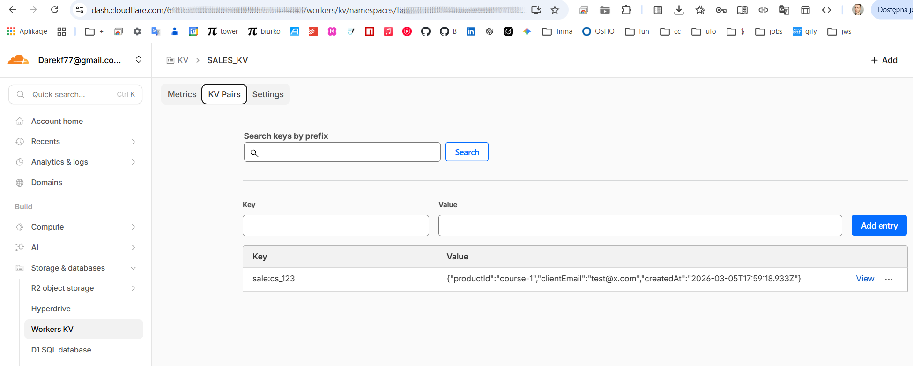
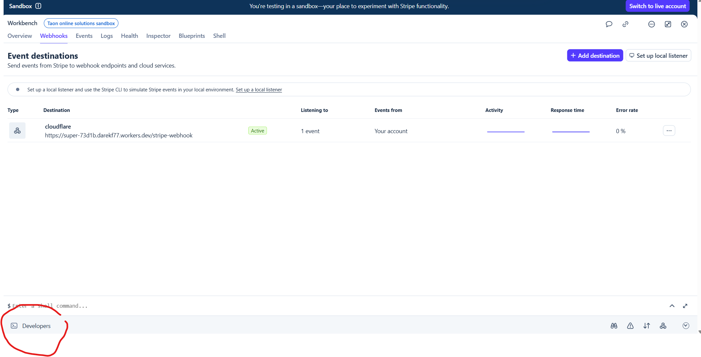
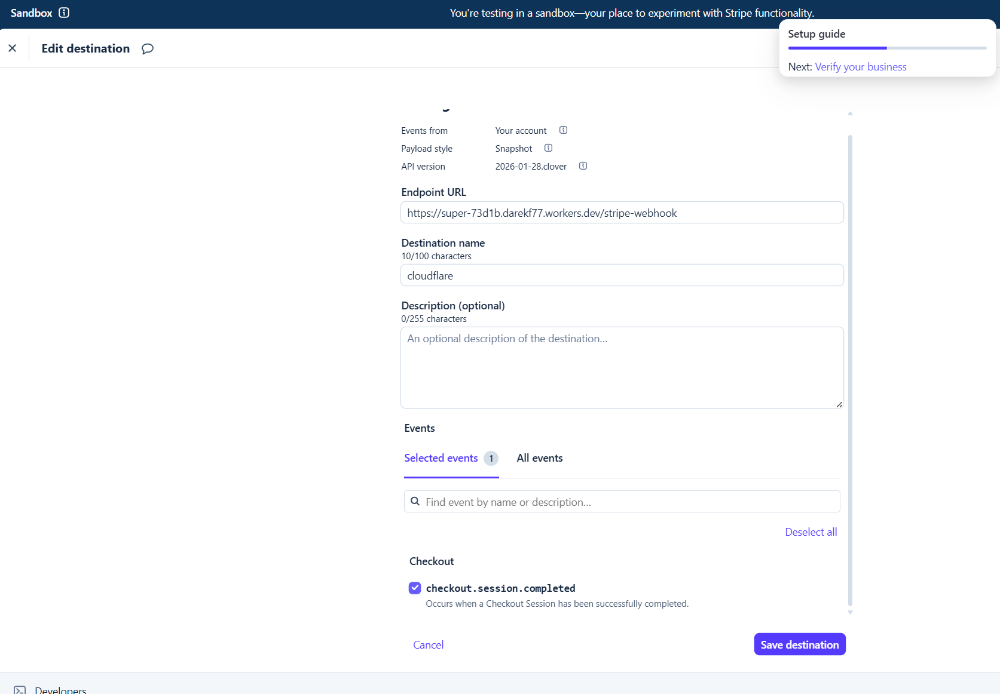
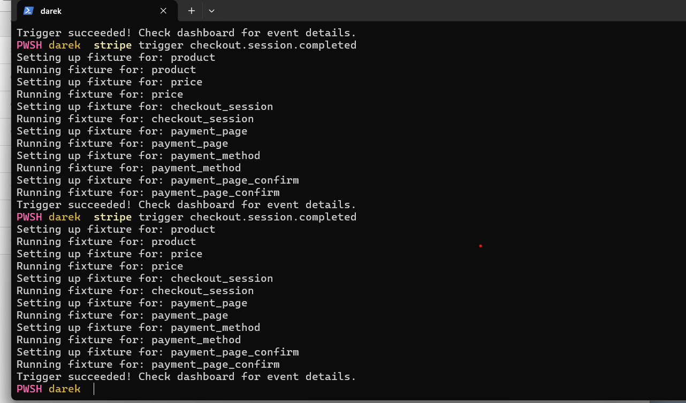
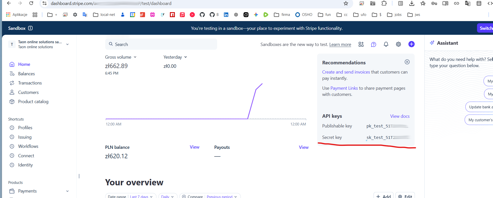
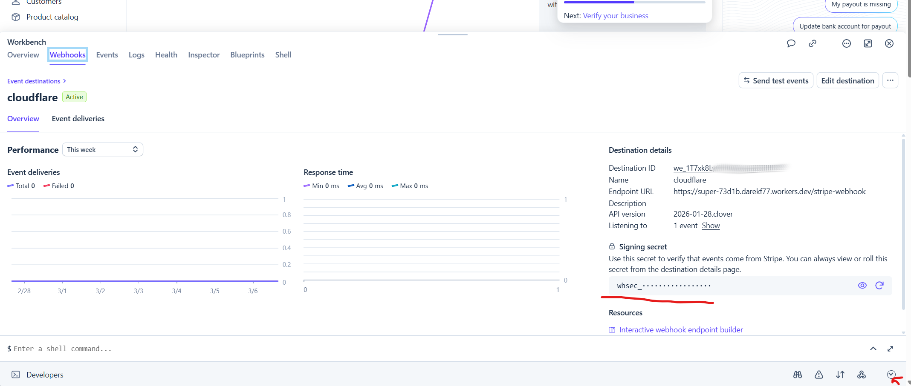

# taon stripe cloudflare worker


1. Login to cloud flare
```bash
cd taon-stripe-cloudflare-worker
npm install
npx wrangler login
```

2. Add storege in cloud flare
```bash
npx wrangler kv namespace create "SALES_KV"
```

You will se something like this
```
 npx wrangler kv namespace create "SALES_KV"

 ⛅️ wrangler 4.69.0 (update available 4.70.0)
─────────────────────────────────────────────
Resource location: remote 

🌀 Creating namespace with title "SALES_KV"
✨ Success!
To access your new KV Namespace in your Worker, add the following snippet to your configuration file:
{
  "kv_namespaces": [
    {
      "binding": "SALES_KV",
      "id": "KEY_TO_SALES_DB"
    }
  ]
}
√ Would you like Wrangler to add it on your behalf? ... yes
√ What binding name would you like to use? ... SALES_KV
√ For local dev, do you want to connect to the remote resource instead of a local resource? ... yes
```


3. Check is thing are created

https://dash.cloudflare.com




4. Deply local worker
```bash
cd matrix-reloaded-731a
npm run deploy
```
Output
```
> matrix-reloaded-731a@0.0.0 deploy
> wrangler deploy


 ⛅️ wrangler 4.69.0 (update available 4.70.0)
─────────────────────────────────────────────
Total Upload: 7.36 KiB / gzip: 2.04 KiB
Worker Startup Time: 5 ms
Your Worker has access to the following bindings:
Binding                                              Resource
env.SALES_KV (fa87dffd301c4fa5ae9c9b01171b26a2)      KV Namespace

Uploaded matrix-reloaded-731a (5.04 sec)
Deployed matrix-reloaded-731a triggers (4.75 sec)
  https://matrix-reloaded-731a.darekf77.workers.dev
Current Version ID: 59e1bc42-0931-4e7f-b612-70b7a4e080ad

```
And from now in your dashboard you should have


6. Install stripe cli
```bash
# macos
brew install stripe-cli

# windows
choco install stripe-cli

# linux
curl -s https://stripe.dev | sudo gpg --dearmor -o /usr/share/keyrings/stripe.gpg
echo "deb [signed-by=/usr/share/keyrings/stripe.gpg] https://packages.stripe.dev/stripe-cli-debian-local stable main" | sudo tee /etc/apt/sources.list.d/stripe.list
sudo apt update
sudo apt install stripe
```


6. Add webhook in stripe


**stripe trigger checkout.session.completed**




7. Trigger stripe event to test worker


```bash
stripe trigger checkout.session.completed
```


8. Add stripe secret

```bash
npx wrangler secret put STRIPE_SECRET_KEY
```




9. Add stripe webhook secret


```bash
npx wrangler secret put STRIPE_WEBHOOK_SECRET
```


